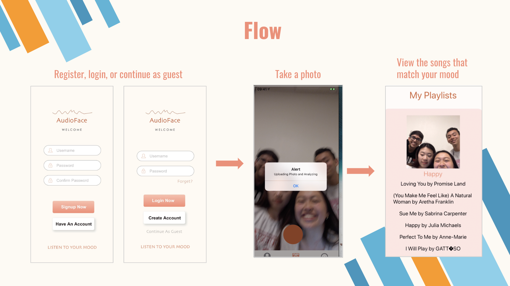
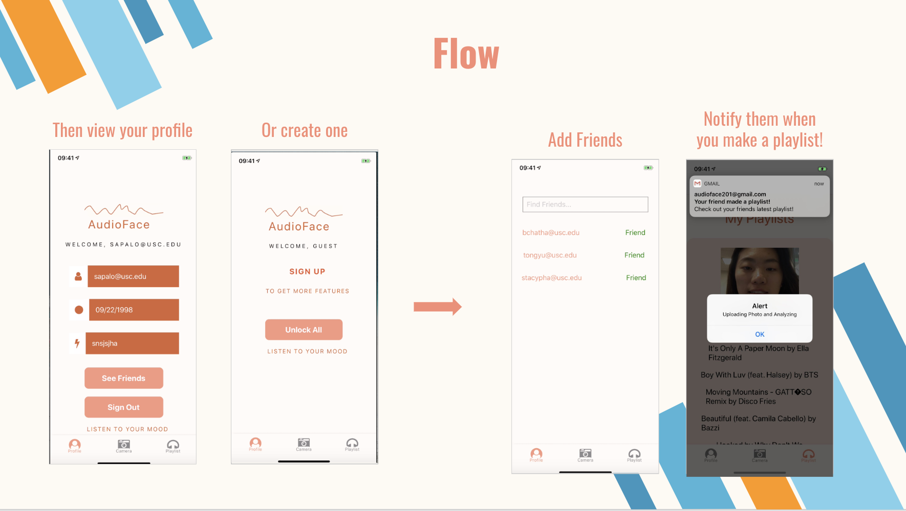

# AudioFace

### What is AudioFace?
A mobile application that analyzes emotion/mood of a selfie you take in-app, and then adds a Spotify playlist to your Spotify account (for registered user only) that corresponds to that mood. Registered users have a additional functionality that allows them to friend other users - when you make a playlist using our application, each of those users will be notified of the action via email. Guest users have the ability to make playlists (although the playlists include a limited number of songs compared to registered users' accounts), but don't have the ability to make friends.

### Learned Technologies/Skills:
* Wireframing | Sketch
* Cross-Platform Language | React Native
* Facial Recognition | Microsoft Emotion Recognition API
* Emulators and SDKs | Expo CLI
* Databases | Firebase and MySQL
* Security | Spotify OAuth
* Email Notifications | Gmail SMTP

### App Flow:

### All Application Screens:

